# Netflix Originals Calendar

## Assignment Completion Status

### Goals
*  - The calendar should render events in the “Monthly” view
*  - The app should be URL driven. So visiting h​ ttp://localhost:<port>/2018/4​ should take
a user to April of 2018. Visiting an invalid URL should take the user to the current
month.
*  - Provide a simple ​Previous​ and N​ ext​ month button to allow navigation between
  months.
*  - Figure out a client-side algorithm for title launch placement within the calendar cells.
  Use the events provided ​here​ as a sample. N​ ote that while the provided events are
  finite, in practice the number of titles launched in a month are in the thousands.
*  - Fetch the provided events JSON from a simple node.js server.
*  - Figure out a client-side algorithm for how you will render the weeks and days.
*  - Use ​Flexbox​ or ​CSS Grid​ to render and style the calendar. Do not use the Table
element. While this is not a design position, we do look for a sense of design, so feel free to make this look good, but if you find yourself up against the 4 hour mark, don’t sweat it.

### Additional Goals

*  - Created Additional Test data based off https://media.netflix.com/gateway/v1/en/titles/upcoming
```typescript
// Use following import in server/app.ts  
import {events} from './data/large-test';
```

## Application Screen Shots

### Original Test Data
Following are the screen shots of the Application using Original Test Data

 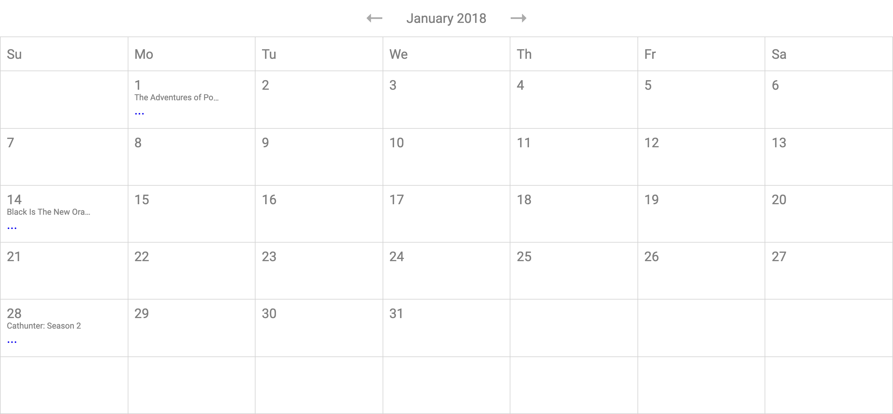
 
 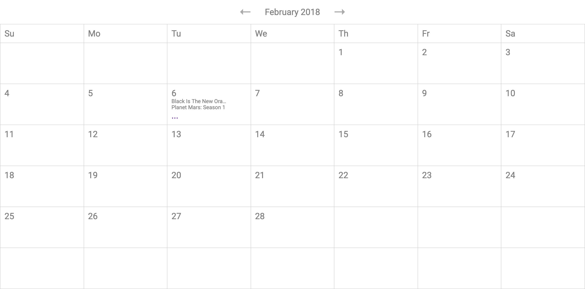
 
 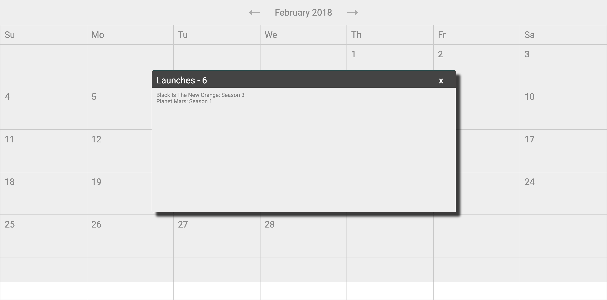

### Netflix Live Test Data

Following are the screen shots of the Application using Netflix Live Test Data

__server/app.ts__
```typescript
import * as express from 'express';
import * as path from 'path';
// import {events} from './data/original-test';
// import {events} from './data/modified-test';
import {events} from './data/large-test';
const app = express();


app.get('/api/events', (req, res) => {
  /**
   * An example of handling query parameters and bad requests:
   */
  // const { filterString } = req.query;

  // if (!filterString) {
  //   res.statusMessage = `Must provide a filterString query parameter.`;
  //   res.sendStatus(HttpStatus.BAD_REQUEST);
  //   return;
  // }
  res.json({
    data: events
  });
});

/**
 * These endpoints are used for deploying the Heroku app, which serves
 * both the server and client. Testing the client locally should be done
 * with the CRA server, which proxies requests to this server for /api, but serves
 * the content separately for HMR.
 */
app.use('/static', express.static(path.join(`${__dirname}/build/static`)));
app.get('/*', (req, res) => {
  res.sendFile(path.join(`${__dirname}/build/index.html`));
});

export default app;

```

 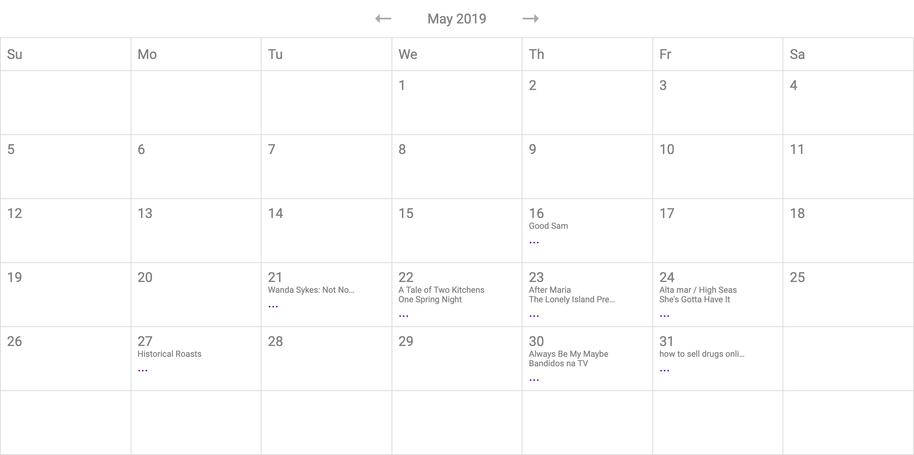
 
 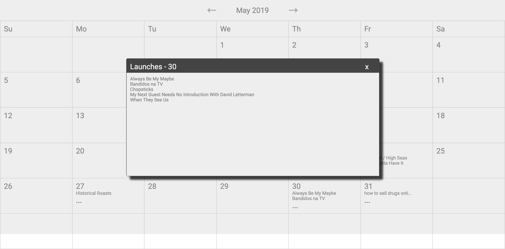


### Use Case 1 - Handling Invalid URL

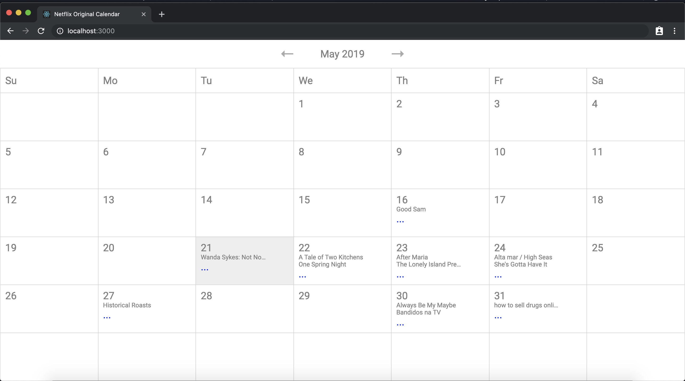

### Use Case 2 - Next and Prev - Updating the URL
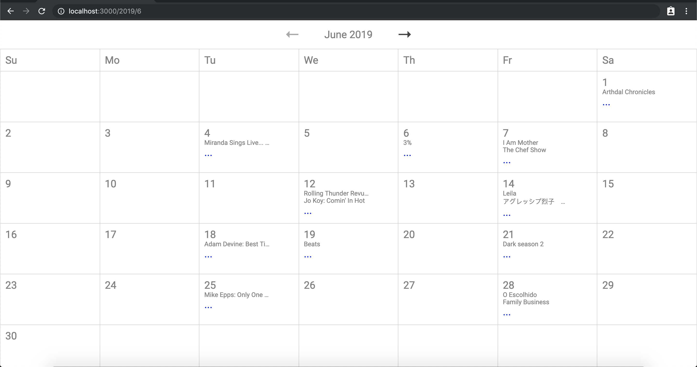

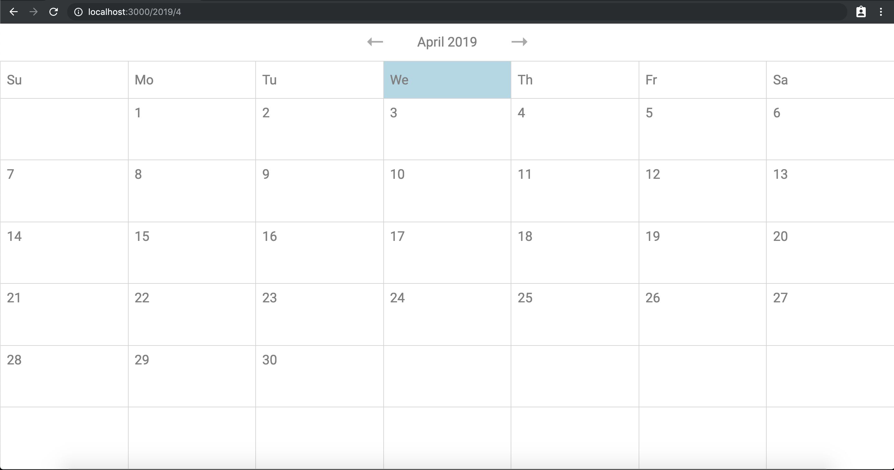


## Setup

```bash
$>npm install
$>npm start
```

Open browser - http://localhost:3000


## Trade Offs/Decisions Made

### CSS Approach
* To keep the scope of the assignment minimal I went with vanilla css approach
* In real world scenario the choice between CSS vs JSS or more traditional SAAS/LESS approach depends on how the organization structures its team/assets for reuse and set performance criteria (minified css vs compiled css)
* For most part CSS Grid was used to render - the Week days and Month Days in a Calendar format.
* Due to some last minute fixes to the grid sizes - there is a flicker introduced during navigation. This can be fixed with adjusting css grid row size using combination of auto and minmax. Currently I did not do this.
```css

.weeks {
    display:grid;
    grid-template-columns: repeat(7,1fr);
    grid-template-rows: 1fr;
    border-right: 1px solid lightgray;
}

.weekDay {
    display:grid;
    padding:10px;
    align-content: center;
    border-top: 1px solid lightgray;
    border-left: 1px solid lightgray;
}
.weekDay:hover {
    background: lightblue;
}

.days {
    display:grid;
    grid-template-columns: repeat(7,1fr);
    grid-template-rows: repeat(6,1fr);
    border-right: 1px solid lightgray;
    border-bottom: 1px solid lightgray;
 }

.day {
    padding:10px;
    border-top: 1px solid lightgray;
    border-left: 1px solid lightgray;
}

.day:hover {
    background: #eee;
}


```
### Calendar Month/Week/Day Rendering Logic
* I have made use of an service class to abstract out all the logic and there is a Test Case for the same.
```typescript
export interface ICalendar {
  /**
   * Provide Weekdays of Week
   */
  getWeekDays(): string[];
  /**
   * Provide Month Name against Month Number
   * @param month (1-12)
   * @return Month Name for given month
   */
  getMonth(month: number): string;
  /**
   * Provide Number of days in a month
   * @param month (1-12)
   * @param year e.g 2012
   * @return Number of day for given month
   */
  daysInMonth(month: number, year: number): number;

  /**
   * Provides first day in a month starting from Monday (1 is Monday, 2 is Tuesday, etc)
   * @param month (1-12)
   * @param year e.g 2012
   * @return First Day in a Week starting from Monday
   */
  firstDayInMonth(month: number, year: number): number;

  /**
   * @return Get Current Month Year Tuple
   */
  currentMonth(): IMonth;
  /**
   * Increment Month Year Tuple by 1 and return next Month Year Tuple
   * @param month
   * @param year
   * @return Get Next Month Year Tuple
   */
  nextMonth(month: number, year: number): IMonth;

  /**
   * Decrement Month Year Tuple by 1 and return previous Month Year Tuple
   * @param month
   * @param year
   * @return Get Previous Month Year Tuple
   */
  prevMonth(month: number, year: number): IMonth;
}
```
### Component Design
* As for Components I have kept things to minimal - Month Component, Launch and Dialog Components are presentation components. There is a Calendar Component which is a HoC Component which deals with Navigation and Data Fetch
* This could be further broken down to Month, WeekHeader, DayGrid, Launch, LaunchDialog Components. But since there was no explicit need to reuse for this assignment, I have mostly kept components as described in the above line. 
* The HoC Component - Calendar is written using React Hooks. 
* The Calendar component makes an API Call to the backend on every navigation. 
* If we had an api as /year/month we could do optimization to fetch next/prev month during our navigation. But that part depends on State Management decisions and Cache Management Decisions
* Ideally we want to navigate to the next or prev month instantly using local cache.

### State Management
* As of now, the state management is extremely crude and we use React State (Calendar Component) to manage this.
* For most part the application fetches all the data at every navigation. This can be improved with segregated api design (/api/events/:year/:month)
* Ideally in real world application we would want to have state management like Apollo Cache, Redux or Mobx to have application level state.
* This application level state would also act like cache and enable instant navigation without wait. 


### Backend API
* The backend API is a data dump API, as in it does not have any segregation for /api/event/:year/:month/:day.
* Ideally the backend API should have this segregation this would greatly reduce the payload fetched each time
* I personally prefer going with the GraphQL Route. Here is an example we can optimize the payload with graphql

```graphql
query month(month:$month) {     # API to be called for rendering Months, fetches limited launches (3 per day)
    month(where:{month:$month}) {
       day {
          launches(limit:3) {   # We can even paginate to fetch only the first launches to reduce the payload 
            id
            name
          }
       }
    }
}
query day(day:$day) {           # API to called for rendering the Dialog Box, fetches all launches for the day 
    days(where:{day:$day}) {    
        launches {              # No Pagination - Fetch all the launches for the day
            id
            name
        }
    }
}

```
* We could use a combination of Pre-fetching a limited set of prev/next months along with graphql subscriptions to update this limited set on the fly. With this approach we can minimize the server calls on each navigation


## Performance

## React Profiler

Following are the screenshots of React Profiler

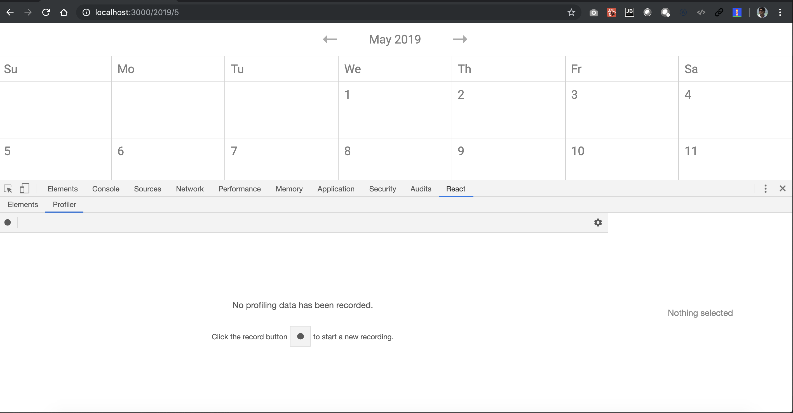
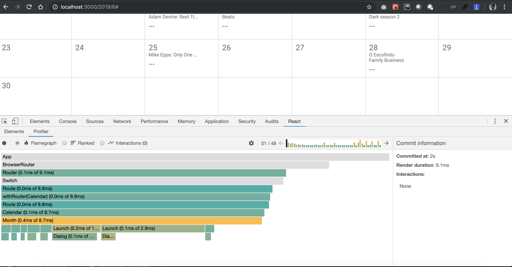

## React Profiler

Following are the screenshots of Chrome Performance - User Timings


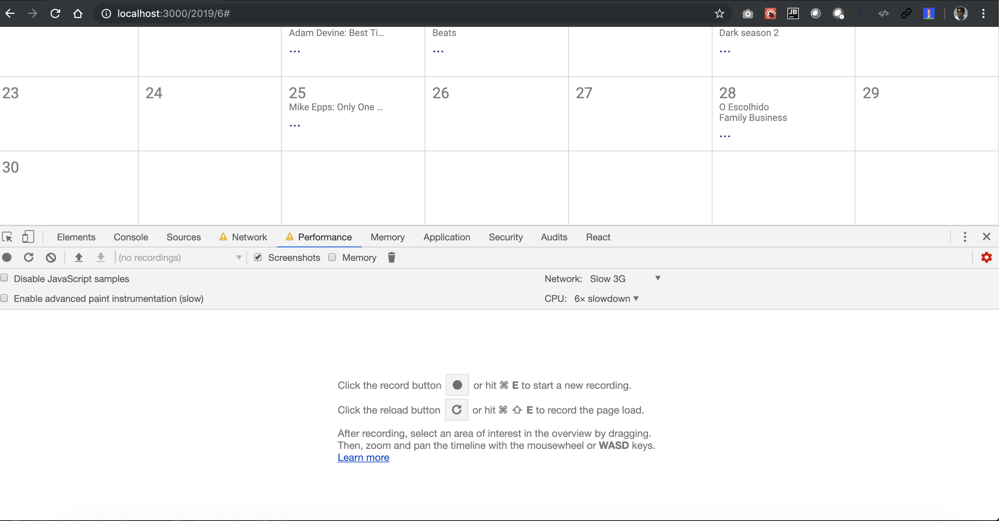
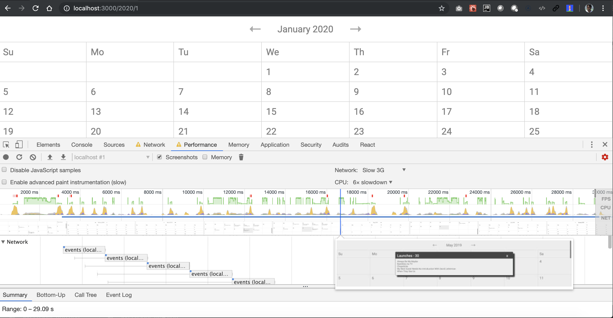
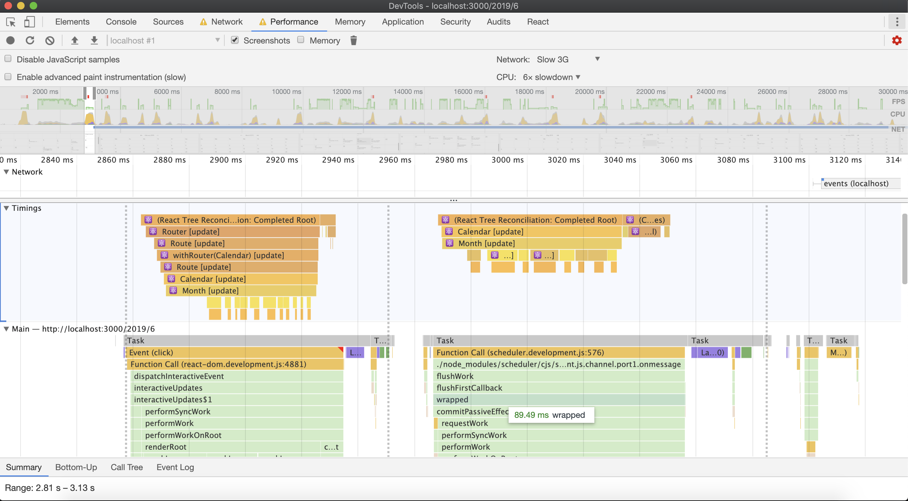
